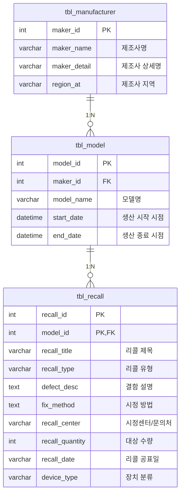

# 1. 👥팀 소개
🚗 **motor-chata**

<table>
  <tr align="center">
    <td><br><b>김민하</b></td>
    <td><br><b>배재현</b></td>
    <td><br><b>윤지혜</b></td>
    <td><br><b>전윤하</b></td>
    <td><br><b>정다솔</b></td>
    <td><br><b>홍진서</b></td>
  </tr>

  <tr align="center">
    <td>
        <b>- GitHub 총괄 관리
        <br>- ERD 작성
        <br>- Figma UI 디자인
        <br>- ERD 작성
        <br>- 로직 설계 </b></td>
    <td>
        <b>- 발표
        <br>- 대본 작성
        <br>- ERD 작성 </b></td>
    <td>   
        <b>- 노션 정리
        <br>- ERD 작성 보조
        <br>- 웹 크롤링
        <br>- 데이터 전처리
        <br>- DB 적재 </b></td>
    <td>
        <b>- 일정 관리
        <br>- ERD 작성
        <br>- Streamlit 구현
        <br>- DB 스키마 모델링(코드 변환)</b></td>
    <td>   
        <b>- 회의록 보조
        <br>- ERD 작성
        <br>- DB 구축
        <br>- 웹 크롤링
        <br>- DB 적재</b></td>
    <td>   
        <b>- 회의록 작성
        <br>- ERD 작성
        <br>- PPT 작성
        <br>- 대본 작성</b></td>
  </tr></table>

---
# 2. 프로젝트 기간
2026-02-04 ~ 2026-02-06

---
# 3. 프로젝트 개요
## 프로젝트명
### 🚗motor-chata
## 프로젝트 소개
 리콜 정보는 제도적으로 제공되고 있지만, 실제 차량 이용자가 이를 이해하고 활용하기에는 구조적인 한계가 존재합니다. 사용자들이 리콜 정보를 주기적으로 확인하거나 자신의 차량과 관련된 결함을 체계적으로 파악하기 어렵고, 정보 탐색 과정에서 요구되는 인지적 부담과 탐색 비용도 높습니다.
 <br>본 프로젝트는 이러한 문제를 해결하기 위해 정보 전달 방식과 인터페이스 구조를 개선함으로써, 이용자가 자신의 차량 상태를 더 쉽게 이해하고 문제를 빠르게 인식·대응할 수 있는 환경을 제공하고자 개발되었습니다.
## 기대효과
- **리콜 정보 접근성 향상**
<br>분산된 리콜 데이터를 한 화면에서 제공함으로써, 차량 결함 정보 탐색에 필요한 시간과 비용을 크게 줄일 수 있다.
- **안전 위험 사전 예방 효과**
<br>차량별 반복되는 결함 패턴과 위험 요소를 명확히 확인할 수 있어, 운행 중 발생할 수 있는 안전사고 가능성을 줄이는 데 기여한다.
- **차량 유지관리 수준 향상**
<br>시정 방법 및 문의처 정보를 제공하여 운전자가 필요한 점검이나 조치를 즉시 확인하고 대응할 수 있도록 지원한다.
- **제조사·모델 간 품질 비교 용이**
<br>브랜드별·차종별 리콜 패턴을 비교해 차량 품질 수준을 직관적으로 확인할 수 있어, 장기적 차량 선택 기준 수립에 도움을 준다.
- **사용자 경험 개선(UX 향상)**
<br>검색·필터·요약지표(KPI) 등 직관적인 UI를 통해 리콜 정보 활용성을 높이며, 이용자가 결함 정보를 쉽게 이해할 수 있도록 한다.
- **정책 및 제조사 개선 인사이트 제공**
<br>축적된 리콜 데이터를 분석하면 특정 제조사나 모델의 반복 결함을 파악할 수 있어, 제도 개선이나 서비스 품질 향상을 위한 자료로 활용될 수 있다.
## 대상 사용자
중고차 구매자와 차량 보유 운전자가 리콜 이력과 시정 방법을 쉽게 확인하고,
초보 운전자 및 자동차 정보 콘텐츠 제작자까지 활용할 수 있는 서비스입니다.

---
# 4. 프로젝트 설계
## 프로젝트 구조
```
motor-chata/
│
├── 📁assets/                 # 서비스에서 사용하는 이미지, 아이콘 등 정적 리소스
│
├── 📁data_pipeline/          # 데이터 수집·전처리 파이프라인
│   ├── .env                  # DB 접속 정보 및 API 키 등 환경변수 설정 파일
│   ├── crawling.ipynb        # 자동차 리콜 정보 크롤링용 Jupyter Notebook
│   ├── data.py               # 크롤링 데이터 전처리 및 가공 스크립트
│   ├── recall.csv            # 원본 리콜 데이터(csv)
│   └── recall_exploded.csv   # 전처리 후 모델/기간 분리 등이 반영된 리콜 데이터(csv)
│
├── app.py                    # Streamlit 메인 애플리케이션 (서비스 실행 엔트리 포인트)
├── recall_repo.py            # DB 연동 및 리콜 데이터 조회/저장 함수 모음(Repository 레이어)
├── README.md                 # 프로젝트 개요 및 사용 방법 문서
├── LICENSE                   # 라이선스 정보
└── .gitignore                # Git 버전 관리에서 제외할 파일/폴더 설정

```
## DATABASE MODEL



## Table Specification
<tr align="center">
    <td><br></td>
</tr>

---
# 5. 트러블 슈팅
### 1) DB URL 연결 불가 이슈
#### Problem
- 본인 PC에서만 MySQL 서버 접속 시 Connection timed out 지속 발생.
- Ping/Telnet 테스트 결과, 팀원들 IP는 모두 차단되고 8.8.8.8만 연결됨 → 아웃바운드 통신 문제로 판단.
#### Attempts
- 권한 확인, 계정 변경, 네트워크 변경, 방화벽 설정, MySQL 설정 수정 모두 시도했으나 해결되지 않음.
#### Conclusion
- 원인은 DB가 아니라 로컬 PC(OS/네트워크 스택)의 IP 차단 문제로 결론.
- 프로젝트 종료 후 OS 재설치로 해결 예정.

### 2) 외부 사이트 요청 실패 문제
#### Problem
- Selenium 크롤링 중 특정 페이지에서 반복적으로 `UnexpectedAlertPresentException` 발생.
- 사이트에서 “잘못된 접근입니다” 알림창을 띄우며 자동화 요청으로 판단해 차단됨.
#### Cause
- `execute_script()` 반복 호출로 비정상 패턴 탐지됨.
- 페이지 이동 속도가 지나치게 빨라 봇으로 인식됨.
- 동일한 페이징 구조(1→2→3→...)가 지속적으로 요청되어 rate-limit 발동.
#### Solution
- 요청 간 딜레이를 `time.sleep(0.2)` → `time.sleep(1)` 로 증가.
- 일정 시간(5~10분) 대기 후 재접속하여 차단 해제.

### 3) Streamlit 텍스트 렌더링 오류
#### Problem
- DB에서 조회한 `결함내용` 컬럼이 Streamlit 화면에서 일부 문장이 취소선(~) 처리로 출력됨.
- 원본 데이터에는 문제가 없지만, UI에서 Markdown으로 해석되면서 가독성 저하 발생.
#### Cause
- `st.write()` / `st.markdown()` 은 기본적으로 Markdown 문법을 해석함.
- `결함내용` 텍스트에 포함된 `~` 문자가 Markdown의 취소선 문법으로 인식되어 의도치 않은 렌더링 발생.
#### Solution
```
result_text = row["결함내용"]
st.text(result_text)
```

### 4) Streamlit 차트 출력 오류
#### Problem
- Streamlit 기반 자동차 리콜 분석 서비스의 통계 탭에서 제조사별 리콜 현황 및 연도별 리콜 추이 차트가 정상적으로 표시되지 않는 문제가 발생함.
#### Cause
- 기존 구현에서 `x` 파라미터에 컬럼명이 아닌 list 객체를 전달하여 Streamlit API 요구사항과 불일치 발생.
#### Solution
- UI 레이어(`app.py`)에서 수정 진행.
- 차트 렌더링 직전, 집계 결과를 DataFrame으로 변환하여 `x`, `y` 파라미터에 컬럼명을 명시.
```
List[Tuple]` → `DataFrame(columns=[...])
x=list` → `x="컬럼명"
```

---
# 6. 기술 스택

### 🛠 Development Environment
- PyCharm
- GitHub

### 📡 Data Collection
- Requests
- Selenium
- BeautifulSoup4
- JSON Parsing

### 🔧 Data Processing / Preprocessing
- Pandas

### 🗄 Database
- MySQL
- ERDCloud (ERD 설계)
- CSV Import

### 🌐 Web Application
- Streamlit

### 🎨 UI / Documentation
- Figma
- Notion


---
# 7. 데이터 출처
- 자동차리콜센터 (국토교통부 · 한국교통안전공단 제공)
- https://www.car.go.kr/ri/stat/list.do
본 프로젝트의 리콜 정보, 결함 내용, 시정 방법 데이터는 자동차리콜센터의 공개 데이터를 기반으로 크롤링하여 수집했습니다.

---
# 팀원 회고
| **김민하** | 회고 내용                                                                                                                                                                         |
|---------|-------------------------------------------------------------------------------------------------------------------------------------------------------------------------------|
| **배재현** | 명확한 판단을 바탕으로 프로젝트 진행 전반의 구조를 잡아주는 역할을 수행하였다. 특히 ERD 작성과 Git 관리를 통해 개발 과정에서의 혼선을 줄이는 데 기여했으며, Streamlit 구현에 대한 초안을 보여주는 등 전체 흐름을 고려한 작업 배분과 정리를 통해 프로젝트 전반에 걸쳐 팀적으로 효율을 극대화하였다. |
| **윤지혜** | 프로젝트 전체 구조를 빠르게 파악하고 로직을 안정적으로 이끌어 팀 진행 흐름을 잡아주었습니다. 핵심 지점을 정확히 짚는 피드백이 프로젝트 진행에 도움이 되었습니다.                                                                                   |
| **전윤하** | 프로젝트 전반에서 GitHub를 핵심 협업 도구로 지속적으로 관리하며 팀 작업의 일관성과 효율성을 유지하는 데 중요한 역할을 했습니다. 또한 Figma 제작 등 추가적인 도움이 필요할 때마다 신속하게 지원하여, 빠른 속도로 프로젝트가 진행될 수 있도록 팀 전체의 작업 흐름을 원활하게 만들어 주었습니다.     |
| **정다솔** | 팀장 역할은 아니었지만 자연스럽게 프로젝트를 이끌며 전체 흐름을 잡아주었다. 의견을 물어보면 결정과 피드백이 빨라 프로젝트 진행이 수월했고, 요구사항도 명확해 방향을 잡는 데 큰 도움이 됐다.     |
| **홍진서** | 프로젝트 내용 중 빠지거나 놓친 부분을 잘 잡아주었고, 팀의 중요한 결정이 필요할 때 타당한 이유와 함께 의견을 내주어서 프로젝트가 원활히 진행되는데 큰 역할을 했습니다.        |

| **배재현** | 회고 내용 |
|-----------|---------------------------------------------------------------------------------------------------------------------------------------------------------------------------------------------------------------------------------------------------------------------|
| **김민하** | 프로젝트 전반에 대한 이해를 바탕으로 강한 책임감과 열정을 가지고 회의를 주도하였으며, 매 회의마다 그날의 할 일과 진행 상황을 체계적으로 정리하여 공유하였습니다. 맡은 업무에 대해서도 끝까지 책임지고 수행하는 모습이 인상적이었습니다. |
| **윤지혜** | 코드 분석력이 뛰어나 불필요한 부분을 정확히 짚어 개선해주었고, 기획 의도를 충분히 고민하며 전체 구조가 흔들리지 않도록 방향성을 잡는 데 큰 도움을 주셨습니다. |
| **전윤하** | 프로젝트의 목적과 산출물에 대해 적극적으로 아이디어를 제시하며 기획 방향을 구체화하는 데 기여하였습니다. 프로젝트 내용을 명확하고 깔끔하게 문서화했을 뿐만 아니라, 하루에 여러 차례 팀 미팅을 제안하며 각 팀원의 진행 상황을 공유·정리하는 데 도움을 주었고, 항상 긍정적인 태도로 팀 분위기를 안정적으로 유지하였습니다. |
| **정다솔** | 프로젝트 초반에 방향을 잘 잡아줘 시작할 때 큰 어려움이 없었다. 진행 중 막히는 부분이 있으면 함께 고민해주고 의견도 나눠줘 한 단계 더 나아갈 수 있었다. |
| **홍진서** | 프로젝트 주제의 흐름을 주도하였고, 본인이 맡은 일이 끝났을 때 도움이 필요한 업무가 있는지 물어보면서 팀에 보탬이 되려고 했습니다. |

| **윤지혜** | 회고 내용 |
|-----------|----------------------------------------------------------------------------------------------------------------------------------------------------------------------------------------------------------------------------------------------------------------|
| **김민하** | 코드 품질 향상을 위해 지속적으로 고민하고 개선하려는 태도가 돋보였으며, 노션 정리와 README 문서 작성을 주도적으로 맡아 프로젝트의 전반적인 정리를 체계적으로 이끌었습니다. 또한 항상 근거를 바탕으로 한 의견을 제시하여 팀의 의사결정에 큰 도움이 되었습니다. |
| **배재현** | 프로젝트 초반 가장 중요한 노션 정리, 데이터 수집과 DB 구축 과정 전체 작업 흐름을 체계적으로 정리하는 데 큰 역할을 하였다. 또한, 프로젝트 마지막 까지 맡은 역할을 끝까지 책임감 있게 수행하며 프로젝트가 안정적으로 진행될 수 있도록 뒷받침하였다. 전반적으로 성실함과 꾸준함을 바탕으로 팀의 기반을 다지는 데 중요한 기여를 하였다. |
| **전윤하** | 웹사이트 구조로 인해 DB 구축 과정에서 여러 기술적 어려움이 있었음에도 끝까지 책임감을 가지고 문제 해결에 임하며 결국 이를 성공적으로 해결하였습니다. 많은 업무 부담 속에서도 노션 정리까지 꾸준히 담당하며, 팀원들이 효율적으로 협업할 수 있도록 기여하였고, 전반적으로 매우 성실하고 끈기 있는 태도가 인상적이었습니다. |
| **정다솔** | 웹 크롤링과 데이터 전처리처럼 복잡한 작업이 많았는데도 끝까지 잘 맡아서 해주셨다. 의견을 내도 잘 들어주시고 차분하게 일을 진행해 프로젝트를 마무리하는 데 큰 도움이 됐다. |
| **홍진서** | 데이터를 전처리하고 정제하는데 끝까지 책임지고, 많은 어려움이 있었지만 바로바로 수정하는 빠른 피드백으로 팀의 효율을 이끌어냈습니다. |

| **전윤하** | 회고 내용 |
|-----------|----------------------------------------------------------------------------------------------------------------------------------------------------------------------------------------------------------------------------------------------------------------|
| **김민하** | 프로젝트 일정 관리와 화면 구현을 전담하여 책임감 있게 수행하였으며, 맡은 역할을 능동적으로 해결하려는 태도가 인상적이었습니다. 또한 피드백을 적극 반영하여 코드 리뷰 시 가독성을 개선하는 등 협업 측면에서도 긍정적인 역할을 하였습니다. |
| **배재현** | 전반적인 일정을 작성하고, 완성된 DB를 바탕으로 Streamlit 구현을 통해 기획 내용을 실제 결과물로 구현하는 데 기여하였다. 또한 밝은 성격을 바탕으로 자신이 맡은 업무를 팀원들과 적극적으로 공유하며 소통을 이끌었다, 이를 통해 팀 분위기를 긍정적으로 유지하는 데에도 큰 역할을 하여, 협업 과정이 원활하게 이루어질 수 있었다. |
| **윤지혜** | Streamlit 구현을 중심으로 실서비스 구조를 만들어주었고, 일정 관리와 트러블슈팅에서도 적극적으로 기여해 팀 진행을 안정적으로 유지했습니다. |
| **정다솔** | 일정 관리도 잘 해주고 본인 의견도 적극적으로 말해줘 좋았으며, 프로젝트에서 Streamlit으로 필요한 기능들을 잘 구현해 전체 흐름이 자연스럽게 이어졌다. |
| **홍진서** | Streamlit을 중심으로 본인이 맡은 바를 잘 수행해나가고, 어떤 일이 주어지면 싫은 기색없이 진행해 나감으로써 팀에 도움이 되었습니다. |

| **정다솔** | 회고 내용                                                                                                                                                                                        |
|-----------|----------------------------------------------------------------------------------------------------------------------------------------------------------------------------------------------|
| **김민하** | 개발 과정에서 발생하는 오류를 세심하게 점검하며 코드를 안정적으로 개선해주었고, 테이블 관계도 설계 과정에서도 문제점을 사전에 발견하여 수정함으로써 팀원들이 불필요한 시행착오를 겪지 않도록 큰 기여를 하였습니다.                                                                       |
| **배재현** | 데이터 수집과 구조 설계 과정에서 높은 집중력과 책임감을 보여주었다. 프로젝트 전반의 다양한 활동에 적극적으로 참여하며 필요할 때마다 구원투수 역할을 수행하여 프로젝트의 기반을 안정적으로 다졌다. 특히 DB 구축 과정에서 팀원들과 긴밀히 협업하며, 기술적인 이해도를 바탕으로 프로젝트의 안정성과 완성도를 높이는 데 중요한 기여를 하였다. |
| **윤지혜** | DB 구축과 ERD 설계를 안정적으로 담당해 데이터 구조 기반을 탄탄하게 만들어주었으며, 팀원들이 ERD를 이해하도록 도와주셔서 테이블 적재 시 많은 도움이 되었습니다.                                                                                               |
| **전윤하** | 팀 내에서 중재자이자 문제 해결자로서 역할을 수행하며, 프로젝트 진행 중 이슈가 발생할 때마다 적극적으로 나서 상황을 정리하고 해결을 도왔습니다. 또한 DB 구축과 웹 크롤링 작업에도 참여하여 데이터 수집과 저장 과정이 안정적으로 이루어질 수 있도록 기여하였으며, 전반적으로 책임감 있게 팀을 지원하는 모습이 인상적이었습니다.       |
| **홍진서** | DB 구축부터 웹 크롤링, ERD까지 전반적인 업무에 주축이 되어 이끌어 가고, 다른 팀원에게 어려움이 있을 때 많은 도움을 주었습니다.                                                                                                                 |

| **홍진서** | 회고 내용 |
|-----------|----------------------------------------------------------------------------------------------------------------------------------------------------------------------------------------------------------------------------------------------------------------|
| **김민하** | 팀 분위기 형성에 큰 역할을 하였으며, 발표 자료(PPT) 제작을 매우 완성도 높게 수행하여 발표자와의 협업 과정이 특히 인상적이었습니다. 의견을 제시할 때 부드러운 태도를 유지하면서도 의도를 명확히 전달하는 커뮤니케이션 능력이 돋보였습니다. |
| **배재현** | 프로젝트 결과를 정리하고 소통 역할을 중심으로 기여하였다. PPT 제작과 발표 단계에 적극적으로 참여하며 팀원들과의 소통을 통해 프로젝트 전반의 내용을 명확하게 정리하였다. 특히 특유의 사교성과 뛰어난 언변을 바탕으로 팀 내 분위기를 자연스럽게 환기시키며, 협업 과정이 원활하게 이루어질 수 있도록 하는 등 팀의 윤활유 역할을 해주었다. |
| **윤지혜** | PPT를 이해하기 쉽게 구성해 프로젝트의 핵심 내용을 명확하게 전달할 수 있도록 도왔습니다. 정리 방식이 직관적이라 팀원들이 전체 흐름을 파악하는 데 큰 도움이 되었고, 발표 완성도 역시 높아졌습니다. 또한 팀 분위기를 부드럽게 유지하는 데에도 자연스럽게 기여했습니다. |
| **전윤하** | 항상 밝고 긍정적인 에너지로 팀 분위기를 이끌며, 팀원이 지치고 어려움을 느낄 때에도 큰 동기부여가 되어주었습니다. 더불어 프로젝트의 결과와 핵심 내용을 잘 정리한 PPT를 제작하여, 팀의 성과를 효과적이고 이해하기 쉬운 방식으로 전달하는 데 중요한 역할을 수행하였습니다. |
| **정다솔** | 회의하면서 놓칠 수 있는 부분들을 잘 잡아줬고, PPT도 프로젝트 의미에 맞게 만들어주셨다. 또한 다른 팀원들의 고민을 잘 들어주고 팀 분위기를 편하게 만들어 프로젝트가 원활히 진행될 수 있었다. |

